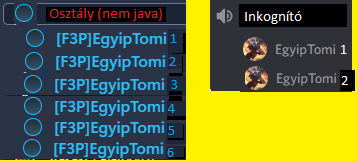

# Menyhárt Tamás és Posta András
## Virtual Reality: Témakör 10: Interaction (kölcsönhatások)

Itt az ember kölcsönhatásairól a virtuális valóságban, motoros képességekről, gépi tanulásról, remappingról, mozgásokról, virtuális tér manipulálásáról és a szociális interakciókról lesz szó.

> Források:

> Könyv szerzője, címe: Steven M. LaValle: Virtual Reality

> Kiadó neve, kiadás éve, oldalszám: Cambridge University Press, 2016, 418 oldal

## Kölcsönhatások a virtuális valóságbam

Az ember és a virtuális tér kapcsolatán az alábbi kérdések merülhetnek fel:
- Hogyan
  - lépjenek kapcsolatba a felhasználók a virtuális világgal? 
  - kellene mozogniuk?
  - tudnak tárgyakat megragadni, mozgatni és elhelyezni?
  - viszonyulnak más entitásokhoz?
  - működjenek együtt a fájlokkal vagy az internettel?

> **<u>Univerzális szimulációs elv:</u>** A valós világ bármely mechanizmusa szimulálható VR-ben.

Példák:
- A felhasználó
  - kinyithat egy ajtót egy gomb (F) megnyomásával
  - egy virtuális repülőgépet üzemeltethet úgy, hogy egy pilótafülkében ül

Az univerzális szimulációs elv nem feltétlenül realizmus. Gyakran jobb az interakció jobbá tétele mint a valóság. Ezért ez a fejezet olyan interakciós mechanizmusokat mutat be, amelyek esetleg nincs megfelelője a fizikai világban. Az 1. szakasz bemutatja az általános gépi tanulási és szabályozási fogalmakat.

> **remapping**: a való világban való mozgás leképezése egy lényegesen eltérő mozgásra a virtuális világban.

Fontos feladataink a virtuális valóság használatához:
- Felhasználó számára a működés, mozgás:
    - könnyen megtanulható
    - használható
    - kényelmes
    - hatékony feladathoz
- Felhasználó számára mozgás megvalósítása a virtuális térben úgy, hogy a valóságban marad.
- A térrel (pl.: tárgyakkal) való interakciók, manipulációk leírása
- A felhasználók egymás közötti interakcióinak, kommunikációjának megoldása

## 1. Motoros képességek és remapping

> **Motoros képességek**: Életünk során fejlesztjük finommotorikus készségeinket számos konkrét feladat elvégzéséhez, mint például szövegírás, cipőfűző kötözés, labdadobás, és biciklizés. Ezeket gyakran motoros kéépességeknek (számítógép esetén gépi tanulásnak) nevezik, és megtanulják ismétlődő próbák révén, a pontosság és a könnyűség fokozatos javulásával, ahogy az elvégzett gyakorlatok száma nő. Végül előállítjuk a mozgásokat anélkül, hogy figyelni is kelljen rájuk. Például a legtöbb ember tud autót vezetni figyelmen kívül hagyva a kormánykerék, a fékek bizonyos műveleteit.

Ezzel a módszerrel mi is megtanultuk pl.: kezelni a számítógépen található interfészt. Próbálkozásokon keresztül az egér hasznalatát könnyen- és hamar el lehet sajátítani, míg a billentyűzeten való vakon gépelés megtanulása akár évekig tarthat.

Tervezési szempontok A VR interakciós mechanizmusainak fejlesztése során:
1. Magas hatékonyság elérése a 
    - feladat elvégzésének gyorsaságában
    - pontosságában
    - mozgási tartomány meghatározásában (opcionális)
2. Az új motoros képességek elsajátításának nehézségei
    - ideális esetben a felhasználónak nem kellene sok hónapot tölteni egy új mechanizmus elsajátításával.
3. Könnyű használhatóság a kognitív terhelés szempontjából
    - az interakciós mechanizmusnak kevés vagy egyáltalán nem kell koncentrált figyelmet igényelnie némi gyakorlás után.
4. Általános kényelem hosszabb ideig tartó használat során
    - Ne alakuljon ki izomfáradtság, hacsak nem valamilyen fizikai gyakorlat a feladat.

Az agy a mozgás megvalósításához elektromos inpulzusokat küld az izmokba, ezáltal mozgásra kényszerítve őket.

(a) Az agykéreg egy része a mozgásnak van szentelve.

(b) Sok más részek kölcsönhatásba lépnek a kéreggel, hogy mozgásokat hozzanak létre és hajtsanak végre, beleértve a talamusz, a gerincvelő, a bazális ganglion, az agytörzs és a kisagy.

> **A mozgás neurofiziológiája**: először is vegyük figyelembe az akaratlagos mozgások (harántcsikolt izomszövet hajtja végre a mozgásokat) tanulásában, irányításában és végrehajtásában részt vevő idegi részt az (a) ábrán. Az elsődleges motoros kéreg a mozgást szabályozó idegi jelek fő forrása, míg a premotoros kéreg és a kiegészítő motoros terület érintett a mozgás előkészítésében és tervezésében. A kommunikáció neutrális jeleken keresztül megy végbe, ahogy azt a (b) ábra mutatja. A kisagy egy speciális feldolgozó egység, amely többnyire a mozgásnak van szentelve, de más funkciókat is betölt.

A **kisagy** egy feldolgozó egység, ami:
-------------
-  101 milliárd neuront tartalmaz, ami jóval több, mint a teljes agykéreg, amely 20 milliárdot
- a mozgást, koordinációs kézségeket, precíz,- finom mozgásokat segíti, teszi lehetővé
- részt vesz a figyelem megtartásában, nyelvben és a beszédben
- a motoros képességek tárolási központja
- széles körű megfigyelések szerint károsodás esetén romlik a:
    - finommotoros kontroll
    - új motoros képességek tanulása
- felhasználása a VR számára a szenzomotoros kapcsolatok tanulása (pl.: szem kéz koordináció).

(a) Atari 2600 lapátvezérlő.

(b) Az Atari Breakout játék, amelyben az alsó vonal szegmense egy virtuális lapát, amely lehetővé teszi a labda pattogását, cél, hogy a labda minden téglának nekiütközzön, ezáltal a téglák megszűnnek.

A motorvezérlő jelek és a szenzoros és észlelési jelek közötti szoros kapcsolat kialakítása kulcsfontosságú számos feladatnál. Ezek a mérnöki területen is széles körben ismert rendszerek, amelyekben az érzékelő-visszacsatolás és a motorvezérlés egyesítik az alkalmazásokban mint például a robotika és a repülőgépek stabilizálása; az ezzel foglalkozó entitás az ún. vezérlőrendszerek. Köztudott, hogy a zárt hurkú rendszert részesítik előnyben, amelyben
az érzékelő információi visszacsatolást adnak a végrehajtás során, szemben a nyílt hurokkal, amely a motorjeleket az idő függvényében adja meg.

Fontos szempont, hogy egy motoros képesség megtanulása mennyi időt vesz igénybe. Ez személyenként eltérő, de van egy várható értéke, ami megfelel a valóságnak (pl.: egér mozgását mindenki hamarabb megtanulja, mint a vakon gépelést a billentyűzeten).

> **Neuroplaszticitás**: az agy azon képessége, hogy átszervezze idegi struktúráit
és új utakat (idegi pályákat) alakítanak ki az új ingerekhez való alkalmazkodáshoz. Kisgyermekkorban szinaptikus metszés a mértéke a legnagyobb, ami az idő folyamán exponenciálisan csökken (ezért fontos gyerekkorban a tanulás pl.: egy kisgyerek rövid idő alatt képes megtanulni egy egész nyelvet is, ami egy felnőttnek már nehezése esik). Emiatt az egészséges felnőtteknél körülbelül feleannyi szinapszis van neurononként, mint egy két vagy három éves gyermeknek. Viszont a csökkenés mértéke az agy mentális tornáztatásával jelentősen csökkenthető, így megelőzhetőek olyan időskori betegségek, mint a demencia.

> **Motoros képességek tanulása**: legyen egy egyszerű,- klasszikus példa a Breakout videojáték, amit az Atari fejlesztett ki 1976-ban. A játékos elforgatja a gombot, amely az (a) ábrán látható. Ez a képernyő alján lévő vonalszakasz vízszintes elmozdulását okozza. A lapát egy potenciométert tartalmaz, amely kalibrálással lehetővé teszi a gomb orientációjának megbízható becslését. A játékos látja a vonalszakaszt a képernyő alján, és gyorsan társítja a gombok tájolását. A tanulási folyamat tehát magában foglalja a vizuális észlelést, a
propriocepciós jeleket a gomb elforgatásából és a szenzomotor meghatározását.

(a) Apple Macintosh egér.

(b) Ahogy az egér mozog a táblázatban a virtuális ujj ennek megfelelően mozog, de 90-al el van forgatva fokra és nagyobb távolságot tesz meg.

> **Kapcsolatok és a fizika törvényei**: Egy ügyes játékos gyorsan tudja elforgatni az egeret, így a kéz egy kicsi mozgatásával nagy távolságot tud pontosan meghatározni. Például: ha valaki egy mesterlövész puskával a CS:GO nevű játékot játsza, akkor amikor a másodperc tört része alatt megfordul, és fejbelő, akkor az oroszul való káromkodás után elemezhetjük ezt az eseményt. Tehát, a játékos a kezét minimálisan mozgatta, viszont egy egész emberi test képes volt megfordulni, nagy távolságot megtenni. Gyakori eset, hogy a virtuális tér sokkal jobb teljesítményt tud nyújtani, mint a valóság, mert ott nem (feltétlenül) érvényesek a fizika törvényei. Pl.: Amikor el kezdtünk megfordulni a karakterünkkel t=n idő alatt, ahol lim n -> 0, akkor v=0 m/s sebességből lett v=sok m/s, akkor ha felírjuk a gyorsulást, hogy a=Δv/Δt (sebességváltozás/eltelt idő, ahol az eltelt időt kis időegységre kell nézni, így kicsi az időegységre eső sebességváltozás is) akkor ez a Δt=t(összes) olyan kicsi, hogy nem mérhető, így sok/+0 0-val kellene osztani (ami nem nulla, csak elhanyagolhatóan kicsi), tehát végtelen gyorsulással kezdett el fordulni a karakterünk, ami a valóságban lehetetlen. További probléma, hogy a tehetetlenség törvénye (Newton I.) miatt 1/2 * m * v^2 energiát adtunk a karunknak és a puskának t=n lim n-> 0, ami szintén lehetetlen.  Ugyanígy, végtelen gyorsulással állt meg a játékos karaktere (fordul a karakter, és amikor eléri a másik játékos fejét azonnal megáll). Itt ezen kívül olyan problémák is előfordulnak mint hogy a karunknak és a puskának is van tömege, így érvényes rá a lendületmegmaradás törvénye (Newton II.) is. De sorolhatnék még például olyat, hogy a kezéből a puska távcsövét azonnal a szeméhez rakta egy kattintással. Mivel ezek nincsenek jelen a játéban, így a játékosnak csak az ügyessége és a reflexei számítanak (meg az inputlag nagysága (ping), de ezt most hagyjuk ki). További előnyhöz juttathatja a játékost egy esetleges célkereszt, mivel pontosan tudja, hova fog érkezni egy lövedék, nem kell a klasszikus értelemben véve céloznia.

------------------------------------------------------

> **Motoros képességek a VR-hoz**: Az észlelési élményt a test mozgása irányítja, ami hardvereszközön keresztül érzékelt; az univerzális szimulációs elvet alkalmazva, ami be kerül magába a programba. A fizikai interakcióhoz használt eszköz lehet egy tényleges eszköz, pl.: egy igazi Atari Paddle vagy egy hasonló élményt nyújtó szimulációs eszköz. A fej nyomon követésének esetén elengedhetetlen a nézőpont nagy pontosságú precíz fenntartása és nulla effektív késleltetés; ellenkező esetben a VR élmény jelentősen leromlik. Ez elengedhetetlen, mert a stacionaritás érzékelését fenn kell tartani, ami a hitelesség és a kényelem.

----------------------------------------

> **Remapping**: Más testrészek mozgásainál ez a tökéletes illeszkedés nem
kritikus fontosságú. Ehelyett az idegrendszerünk megtanulhat olyan asszociációkat, amelyek előnyösebbek kényelem szempontjából, ugyanúgy, mint az Atari Paddle, az egér és a billentyűzet a való világban. Így újratérképezést szeretnénk végezni, ami magában foglalja a tanulást a szenzomotoros leképezésben, amely más eredményeket produkál egy virtuális világban, mint ahogy elvárnánk a való világtól. A fenti billentyűzet példa az egyik leggyakoribb példa az újratérképezésre. Az a folyamat, amikor egy ceruzát átnyomunk a papíron, hogy
előállítsunk egy betűt, az egy gomb megnyomásával helyettesíthető. Az újratérképezés kifejezés egy valós világban történő eseményt (pl.: billentyűleütést) alakít át virtuális téren belüli eseménnyé (pl.: itt kilyukasztottuk a virtuális papírt vagy kinyithatunk egy ajtót). Itt is be lehet állítani, hogy pl.: 1 centiméteres mozgás a valóságban 10 centiméternek feleljen meg a VR világában.

--------------------------------------------------

## 2. Mozgás

A Virtuális világ általában nagyobb felületet fed le, mint a valós világban a mozgásterünk. Ebben az esetben valamilyen interakciós mechanizmusra van szükség, ami mozgatja a felhasználót a virtuális világban, miközben a követett területen belül marad a való világban. 

Rendelkezésre álló hely függvényében a lekövetések az alábbiak lehetnek:
- Natív, amikor a felhasználó a szabadban sétál egy headsettel a fején
  - A valós térbeli mozgás leírása megegyezik a virtuális térben leírtakkal
  - Ez adja a leghihetőbb felhasználói élményt
- Félpasszív, amikor a felhasználó a headsettel a fején ül, mozgását lekövetik
  - Ilyenkor nyomon követik, hogy az illető éppen milyen irányba néz
  - Ha forgószék van az illetőnek, akkor a törzs mozgását is szimulálhatják vele (lengési irány)
    - Mivel egy széken mondjuk 60-60 fokban tudunk forogni, így "átverhetjük" a felhasználót, hogy hatszor nagyobb mértékben fordul el a virtuális valóságban, így meg tehet teljes kört (anélkül, hogy egy vezetékes füles körbetekerné).
  - Itt használhat kontrollert, billentyűzetet stb. és pl.: kiváltja a fejével az egér mozgását
    - Egy példa, amikor a TheVR Outlastot játszott Oculus Rift segítségével
- Passzív, amikor még a fej mozgását se követik le, de a headset az illető fején van.
  - Egyes felhasználóknak émelyító lehet forogni, így néha jobban szeretnek gombokkal
  - Gyakori például lövöldözős játékoknál

TheVR Pisti Outlastot játszik Oculus Rift segítségével. (Ez nem lövöldözős játék.) Amerre éppen elnéz, abba az irányba néz a karaktere, így nincs szüksége egérre (vagy csak minimálisan).

###### Forrás: https://www.youtube.com/watch?v=0vuJQjvjzmo&list=PLYbu5a2_BQPMwu2He__sKhON4cRsu1ChQ
###### A link megnyitását nem ajánlom, erősen 18+ a tartalom.

> **Átirányított séta**: Ha a felhasználót a valóságban nagy területen követik (pl.: legalább 30x30 méteres négyzet alakú területen) akkor "át lehet verni" azzal, hogy azt hiszi, hogy kilómétereket sétál előre, miközben csak körkörösen mozog. (Bizonyított tény, hogy az ember nagy távolságot nem tud egyenesen sétálni vizuális jelek nélkül.) Itt probléma lehet, hogyha a felhasználó mondjuk jobbra akar menni hirtelen, és így kimenne a megfigyelési zónából.

----------------------

A VR viszont betegségek kialakulásához is vezethet, ezek általában vektor alapú VR betegségek (többnyire a koordinációs képességek elvesztése). Ennek az elkerülésére az alábbiakat tehetjük:
1. Látószög növelése (a felhasználó ne csak azt lássa, ami pont előtte van, hanem jobbra, balra is még legalább 60-60 fokban.)
2. Ne legyen túl közel a nézőpont a talajhoz, mert torzíthatja a sebesség -és gyorsulásérzetet.
3. Meglepő módon előnyösebb lehet több kisebb eltérésre hosszú időn keresztül, mint egy rövid ideig tartó nagyobb eltérés (pl.: kisebb szöget kell fordulni a székben, mint a virtuális térben jobb, mintha csak hirtelen a semmiből a virtuális tér teljesen elfordulna egy másik irányba). (Lásd: lenti ábra.)
4. Elsimítás efekt növelése, hogy pl.: lépcsőn való mozgás közben a lábunkra koncentrálva ne vegyük észre a megjelenő csíkokat.
5. A kontraszt,- élesség csökkentése, világ homályosabbá tétele, míg hirtelen változásokat eszközölünk, segíthet.
6. Egyéb érzékszervi behatások a hitelesség növelése érdekében hasznosak lehetnek, pl.: fújó szél, rezgő talaj, meleg, hideg, illatok, más mechanikai hatások pl.: érintés
7. Ha a világnak kellene mozognia, nem pedig a felhasználónak, akkor csinálja azt
jelzések vagy speciális utasítások segítségével (pl.: gomb megnyomása).
8. Speciális feladatok ellátása, például lézerrel való kilövés repülő rovarokra nyújthat segítséget elterelni a figyelmet a vesztibuláris konfliktusról. Ha a felhasználó inkább összpontosít és teljesen mozgásban van, akkor gyorsabban megbetegszik.
9. A vektoráció káros hatásai az ismételt gyakorlással csökkenhetnek. Azok az emberek, akik rendszeresen játszanak FPS-játékokat nagy képernyő előtt, már úgy tűnik, csökkent érzékenységük a vektorral szemben a VR-ban. Lehet, hogy nem bölcs stratégia a reménykedő vállalatok számára, hogy a felhasználóknak megköveteljék a gyakorlást az új termékek bemutatására. Képzeljük el, hogy kipróbálunk valami új ételt, amitől émelygés alakul ki az első 20 étkezés után, de aztán fokozatosan megszűnne az émelygés (egyre több étkezéssel). Ki próbálkozna tovább?

Utolsó javaslat, hogy lehetőség szerint kerüljük a mozgást! Próbáljon meg olyan élményeket kialakítani, amelyek nem függenek tőle kritikusan.

Látható, hogy a második esetben végtelen gyorsulással haladunk előre. ezárt a sebesség-idő grafikonon szakadás van, így az út idő grafikonon is, mintha teleportálnánk. Egyébkénta könyv ábra el volt rontva, mert:
- a=Δv/Δt --> Δv=a*Δt --> a-nak t szerinti integráltja v.
- Ha mondjuk az (a) ábrán a konstans, vegyük y = a = 1-nek, akkor az integráltja a*t. (egy egyenes) a középső bal ábrán.
- Mivel v=Δs/Δt --> s=v*Δt --> v-nek t szerinti integráltja s.
- Ha a sebesség-idő grafikon egy y = a * t egyenes, akkor az integrátja 1/2 * a * t^2 (egy parabola a bal fenti ábrán).
- A fenti képletet átírva megkaphatjuk a jól ismert s = a/2 * t^2 képletet, és bebizonyítottuk, hogy ha a gyorsulás állandó, akkor érvényes a négyzetes úttörvény (a megtett távolság az idő négyzetével arányos). Az eredeti ábra akkor lett volna helyes, ha sqrt(t) szerepelt volna t helyett, akkor már lehetett volna egy egyenes az út-sqrt(idő) grafikon.
- Amúgy ez kicsit hajaz a CS:GO-s példára is, azzal a különbséggel, hogy ott meg is állt egy végtelen lassulás következtében.

> **Speciális hardver / eszköz**: A mozgás támogatására sok eszközt fejlesztettek ki (klasszikus billentyűzeten és egéren túl pl.: kontrollerek). Az egyik legrégebbi példa egy teljes pilótafülke létrehozása repülőgépes szimulációhoz. A lenti ábra egy mindenirányú futópadot mutat, amely bármilyen irányban és bármilyen távolságon keresztül lehetővé teszi a gyaloglást. Egy másik példában használhatunk szobabiciklit is, ahol azt szimuláljuk, hogy egy városban biciklizünk.

--------------

> **Teleportáció**: Az eddigi helyváltoztatási módszerek követték az univerzális szimulációs elvet, próbálkoztunk reprodukálni a valóságot, de mivel a VR-ban a fizika törvényei nem (feltétlen) érvényesek, így változtathatunk helyet valószínűtlen módon is, legelterjettebb módszer a teleportáció, amit szerintem nem kell bemutatni. Ennek a megvalósítása általában valami vezérlővel (pl.: kontrollerrel, egy mezőbe való belépéskor) történik. Van, hogy a felhasználó egy lézert tart a kezében, és amire rámutat vele, oda fog teleportálni egy gombnyomás után.

A képen egy virtuális „lézermutató” látható, amely egy parabolaívet követ, így a teleportálás célpontja könnyen megadható pontként a padlón.

A teleportációs mechanizmus csökkenti az átvitelt, és ezáltal a VR-betegséget;
- ára viszont, hogy csökken a tájékozódási képességünk
- fontos, hogy ne változzon közben a nézőpont orientációja

> **Útkeresés**: A térbeli reprezentáció elsajátításának és navigálásra való felhasználásának kognitív problémáját útkeresésnek nevezzük. Vajon az agyunk tárolná az információt a helyekről, ahol járunk, ha tudnánk teleportálni? Széles körben megfigyelhetjük ezt a jelenséget az emberek körében akik navigálni egy városban már csak GPS- vagy taxiszolgáltatások segítségével tudnak, ahelyett, hogy használva a fejüket, hazatalálnának.

## 3. Manipuláció:

Számos okból kölcsönhatásba lépünk a való világ tárgyaival:
- ehetünk egy levest kanál segítségével
- eldobhatunk egy labdát
- leülhetünk egy székre, amit mozgathatunk
- felvehetünk egy nadrágot

A tárgyak változatossága magában foglalja a méretet, a súlyt, a súrlódást,
rugalmasságot, hőmérsékletet, törékenységet stb.Ennek elsajátítása hosszú evulúció eredménye, amit pl.: egy robotnak megtanítani gépi tanulással hosszú és frusztráló munka lenne korlátozott sikerekkel.

Kihasználva a remapping tulajdonságát a VR-nak, nem kell a manipuláció fizikájának teljesen eleget tenni a valóságban.  Ehelyett előnyösebb ilyen műveleteket végezni mint egy tárgy kiválasztása, megragadása, manipulálása, hordozása és elhelyezése, amilyen gyorsan és könnyen az megvalósítható.

Kerülendő:
- hosszú nyújtások
- izomfeszülés
- gorilla karok efektus (amikor hosszabb távon csak tartjuk vízszintesen a kezünket kinyújtva)

Kivéve, ha a VR élmény maximális fokozása a cél vagy testnevelési gyakorlatokra tervezték.

Tom Cruise holografikus kijelzőn mozgatja az ablakokat a 2002-es Minority Report című filmben. Ez egy nagyszerű interakciós mechanizmus Hollywoodból származik, de a valóságban borzasztóan fárasztó. A felhasználó gyorsan megtapasztalná
gorilla karok efektust, mert csak vízszintesen tartja a karját, és beütnek olyan dolgok, mint a forgatónyomaték (M = N * k (erő * erőkar)) + a karunk saját súlya. Ki tudná fáradság érzete nélkül maga előtt tartani a karját hosszú időn keresztül? (Haladók próbálhatják súllyal is.)

> **Szelekció**:  Az egyik legegyszerűbb módja egy objektum kiválasztásának a VR-ban a virtuális lézermutatóval való rámutatás, akárcsak a teleportálásnál. A felhasználó ehelyett tarthat egy zseblámpát is a kezében ehelyett. Az 5. fejezetben sok lehetőség fel van sorolva. A virtuális lézer segítségével a felhasználó egyszerűen megvilágítja a kívánt tárgyat, és megnyomva egy gombot, megragathatja, eldobhatja, manipulálhatja, eltárolhatja stb. Egy ajtó kinyitása esetén pl.: korlátozhatjuk a virtuális lézer bevetési távolságát, hogy csak közelről tudjuk azt kinyitni, hogy ezt ne a szoba túloldaláról tegyük meg, mert ez rontja a VR-élményt.  Ha az objektum nehezen látható, akkor a kiválasztási folyamat bonyolult lehet. Lehet, hogy a felhasználó feje mögött van, ami kényelmetlen elfordulást igényelhet. Az objektum lehet olyan kicsi vagy távoli, hogy csak néhány képpontot foglal el rajta a képernyőt, ami megnehezíti a pontos kiválasztását. A probléma jelentősen megnő rosszabb, ha az érdeklődés tárgya körül jelentős rendetlenség van, különösen, ha más kiválasztható objektumok vannak a közelben. Végül az objektum lehet részben vagy teljesen elzárva a szem elől. Ennek megsegítésére általában úgy használhatjuk a kiválasztót, hogy nem kell pontosan rámutatni a tárgyra, csak a közelébe, hogy kiválasszuk.

---------------------------------

> **Manipuláció**: Ha a felhasználó nagy távolságra visz egy tárgyat, akkor nem
szükséges ahhoz, hogy megszorítsa vagy megragadja a vezérlőt; ez szükségtelen fáradsághoz vezet. Egyes esetekben a felhasználótól elvárható, hogy gondosan ellenőrizze az objektumot miközben birtokában van.  Az objektum tájolását be lehet állítani, hogy pontosan kövesse a felhasználó által tartott vezérlő 3D tájolását. A felhasználó akár egy valódi tárgyat is tarthatna a kezében, amelyet külső kamerák követnek, ezáltal fenn állna az erő-visszacsatolásának illúziója, miszerint a felhasználó tényleg tart egy objektumot a kezében, aminek súlya van. De vegyük figyelembe, hogy egy tárgy a felhasználó valós világ beli beavatkozása nélkül is manipulálható a VR-ban, pl.: ha virtuálisan megragadta, megjelenik a virtuális kezében. Van egy másik módszer, amikor a virtuális tárgyaknak vonzási környezetet határozunk meg, így, ha közel megyünk a tárgyhoz, megragadhatjuk anélkül, hogy a kezünk mozogna. A vonzási környezetet meghatározhatja akár az ember is, csak ez statikusan mindig ugyanakkora, ha pedig tárgyra határozzuk meg a vonzási környezetet, akkor tárgyanként lehet ennek a mérete különböző. A lenti képen van egy példa, amikor a felhasználónak van vonzási környezete, és nem a tárgynak.

Itt láthatjuk, hogy a felhasználó rendelkezik egy vonzási környezettel, ezáltal ha közel megy a tárgyhoz, akkor az ebbe belekerül, így automatikusan megragadásra kerül a tárgy. (Vagy el is tárolhatja magának egy tárgykészletben.) Erre egy konkrét példa lehet a Minecraftban, amikor elejtünk egy tárgyat, akkor az ott fog egy helyben lebegni, de ha túl közel megy hozzá a karakterünk, akkor megragadja, és bele kerül a tárgykészletébe, ezáltal fel tudja használni a tárgyat később.

> **Elhelyezés**: Most fontoljuk meg azt, hogy elhelyezünk egy tárgyat a virtuális térben. Ez legegyszerűbben egy gomb megnyomásával történik, de megtörténhet pl.: egy zónába való belépéskor is automatikusan (hasonlóan a tárgyfelvételnél, nem a Neptunosnál). Az elhelyezés lehet pontos/precíz vagy korrigált (ha a tárgynak konkrét helye van, akkor elég csak a közelébe megpróbálni letenni, akkor a várt helyre fog kerülni az objektum). Erre megint tökéletes példa erre és a remapping fogalomra a Minecraft, amiben, ha leteszünk egy építőkockát, akkor az automatikusan a helyére ugrik, nem pontosan oda, ahová kattintunk, így szép szabályos elrendezés alakul ki. Egy orvosos szimulációnál megkövetelhetjük a precíz elhelyezést, de az emberi kéz és még az eszközeink sem fognak garantálni soha 100%-os pontosságot.

A manipulációs módszerek fejlesztése mái napig az egyik legnagyobb kihívást jelenti a VR fejlesztésében.

## 4. Szociális interakciók

A VR-ban nem csak egyéni élményeket lehet fokozni, hanem a társadalmiakat is. Beszélgetni lehetne a virtuális térben személyesen, akár egy avatár segítségével, amit beállítunk magunknak. Lehetne például konferencia a virtuális űrben.

Virtuális térben a csevegés lehet: (minden esetben headset segítségével)
- Térben tekintve:
  - azonos helyen: személyesen (egy erre kialakított stúdióban)
  - különböző helyeken: akár otthonról laptop kamera és mikrofon segítségével
- Mozgást tekintve:
  - ténylegesen állva; helyváltoztató mozgásokat is végezve
  - ülve egy forgószékben; csak a fej, kéz és törzs mozgásait lekövetve, helyzetváltoztatás vezérlők segítségével
  - ülve; de semmit nem követünk le, minden mozgás csak vezérlőkkel történik
- Személy kinézetét tekintve
  - valódi: ténylegesen látjuk, és felismerjük az adott személyt
  - avatárral meghatározott: a személy a VR-ban más alakot ölt, erről később
- Kommunikáció irányát tekintve:
  - egyirányú
  - kétirányú
- Komminikáció célközönségének a méretét tekintve:
  - 1 ember beszél 1 emberrel
  - 1 ember beszél több emberrel (broadcast) [szerepek cserélődhetnek]
  - 1 ember beszél tömegben csak néhány/egy emberrel (anycast) [szerepek cserélődhetnek]

Most nézzünk egy pár konkrét példát.

Az emberek egy stúdióban beszélgetnek személyesen, állva, mozogva.

Két ember az étteremben ül, a fejük mozgása le van követve, és ehetnek.

###### Forrás: https://www.youtube.com/watch?v=qUnYeTlT25o&t=118s

-------------------

### 4.2 VRChat
-------------------------

Avatárok:
- Lehetőségünk van a VR-ban saját formát ölteni
   - lehetünk démonok, boszorkányok, állatok, ellenkező neműek, más ruhában lehetünk stb.
- Mivel a felismerhetetlenségig eltérhet a valóságtól, így megjelenhet egy név a karakterünk felett.
  - a név lehet a sajátunk egy rövidítés vagy teljesen más,- fantázianév, pl.: EgyipTomi
- Az avatár lekövetheti a kezünk, fejünk, törzsünk, bármink mozgását és remapping segítségével imitálhatja
- Lehetőségünk van élmény fokázása érdekében emojikat, emote-okat használni
  - emoji: úgynevezett hangulatjelek, pl.: egy mosolygós arc
  - emote: tevékenység, ami csak a virtuális térben hajtódik végre, pl.: gombnyomásra szaltózunk egyet

> **Valóság képének torzulása**: Ha 2 ember nagyon sokat beszélget egymással egy álnéven egy avatár segítségével, akkor egy idő után, ha nem találkoznak sokat személyesen (de ismerik egymást!) kialakulhat egy olyan agyi kép, ami az adott személyhez egy avatár képét (mondjuk egy démonét) társítja, és az álneve (pl.: EgyipTomi) hamarabb eszébe jut, mint a valós kinézete és neve.

A képen láthatjuk, hogy megszerkeszhetjük, az avatárunkat és más szociális felületeinket.

Itt azt láthatjuk, hogy a karakterünket akár nagyon aprólékosan megszerkezthetjük. Ez jellemző a legtöbb MMO-RPG játékra mint a Black Desert Onlinera is.

###### Forrás: https://www.youtube.com/watch?v=GD64xoI6IvQ&t=23s

Itt látható a "végeredmény" a VRChatben, hogy az emberek a saját avatárukkal vannak egy virtuális ebédlőben. Mivel nehéz lenne megkülönböztetni őket, ezért van felettük egy név is írva.

### 4.3 Speciális kommunikáció
----------------------------

A legtöbb kommunikációs formát már megszokhattuk és megtanulhattuk nyelvtan órán, de a VR segítségével, ha a térben távol vagyunk egymástól, megvalósulhat egy olyan kommunikációs forma (egy embert szavait rendeljük csak néhányhoz a sok közül; anycast), amikor úgymond társaságban vagyunk a virtuális térben, de amit mondunk, azt onnan csak egy vagy néhány ember hallja. Ezt úgy lehet elképzelni a valóságban, mintha suttognánk azzal a különbséggel, hogy itt nincs annak a veszélye, hogy illetlennek gondolnak minket. Ezt talán úgy lehet elképzelni, hogy mondjuk van egy osztály, aki a teamspeak 3 alkalmazáson keresztül beszélget, de ezek közül 2 ember külön felhívja egymást discordon. Amit discordon mondanak egymásnak, azt a teamspeaken nem fogják hallani a többiek, hiába vannak egy (virtuális) helyen mind egyszerre, mert külön csatornát alakítottak ki egymás között.

Amit discoron mondanak ketten, azt nem hallják ts-en, hiába vannak egy közös térben mind, mert külön csatornájuk van a kommunikációra.

Másik példa lehet, ha elképzelünk egy virtuális tantermet, a tanár kioszt néhány önálló feladatot, akkor tud segíteni a diákoknak egyesével, anélkül, hogy a többieket zavarnák, mert hiába vannak 1 teremben, a tanár ki tud alakítani egy másik kommunikációs csatornát a diákkal.

## 5. További interakciós mechanizmusok

Ez a fejezet az interakciós mechanizmusok három családját fedte le:
- mozgást
- manipulációt
- szociális mechanizmusokat

Ezek a családok több évtizedes kutatás és fejlesztés eredményeként jöttek létre, de nem fedik le teljesen az interakció minden fajtáját